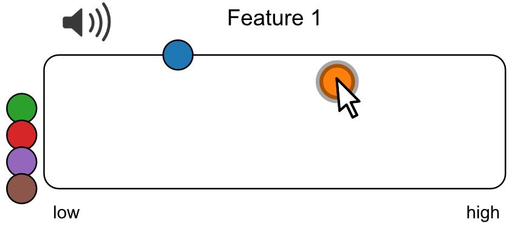
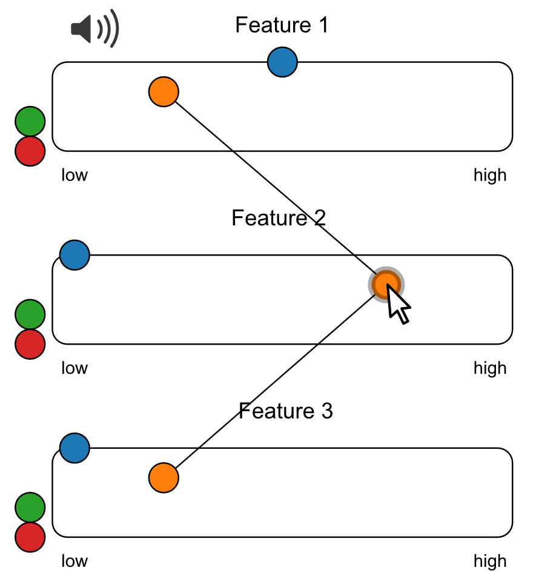

#

This is a Javascript toolbox to perform online rating studies with auditory material. The main feature of the toolbox is that audio samples are associated with visual tokens on the screen that control audio playback and can be manipulated depending on the type of rating. This allows the collection of single- and multi-dimensional feature ratings, as well as categorical and similarity ratings. The toolbox can be used via a plugin for the widely-used [jsPsych](https://www.jspsych.org), as well as using plain Javascript for custom applications.

## Citation

Donhauser, Peter, and Denise Klein. 2021. “Audio-tokens: A Toolbox for Rating, Sorting and Comparing Audio Samples in the Browser.” PsyArXiv. October 16. doi: [10.31234/osf.io/3j58q](https://doi.org/10.31234/osf.io/3j58q)

## Contents

- [Screenshots](#screenshots)
- [Usage](#usage)
- [Results](#results)

## Screenshots

### Single feature rating



### Multiple feature rating



### Sorting


### And more..

You can try the tools interactively in this [blog post](https://peterdonhauser.com/post/audio-ratings/).

## Usage

Here we go through the basic steps of using Audio-Tokens in a jsPsych experiment.

****Note***: jsPsych has had a major upgrade recently (version 7): if you are still using the older version for your experiment, please refer to this example script: [`index_jspsych6.html`](./index_jspsych6.html).*


The complete experiment can be written in one html-file and will look like [this](https://pwdonh.github.io/audio_tokens/index_query.html?type=single_feature). This is the minimal page setup, excluding the jsPsych code:

```
<html>
    <head>
		<title>My experiment</title>
		<script src="//d3js.org/d3.v4.min.js"></script>
		<script src="js/audio-tokens.js"></script>
		<script src="https://unpkg.com/jspsych@7.0.0"></script>
		<script src="js/jspsych-audio-tokens-v7.js"></script>
		<link href="https://unpkg.com/jspsych@7.0.0/css/jspsych.css" rel="stylesheet" type="text/css" />
    </head>
    <body>
    </body>
    <script>
       // All jsPsych code goes here
    </script>
</html>
```

Here we are first importing a few libraries: 
-	`d3.v4.min.js`: This is the d3-library on which the current toolbox is based, it is widely used for visualizing data in web environments
-	`audio-tokens.js`: This is the Javascript code for the rating tools described in this paper.
-	`jspsych.js`: This provides all the basic functionality of jsPsych
-	`jspsych-audio-tokens-v7.js`: This is the plugin that allows us to include the rating tools in a jsPsych experiment
-	More jsPsych plugins can be loaded here in order to build your experiment, e.g. to display instructions

There is nothing written in between the `<body></body>` tags. This is normally where the content of a web page goes: here jsPsych takes care of displaying content according to the trial structure of the experiment.
In between the `<script></script>` tags we will add all the jsPsych code:

```
var single_feature_trial = {
    type: jsPsychAudioTokens,
    ratingtype: 'features',
    stimuli: ['data/speaker1.wav',
              'data/speaker2.wav',
              'data/speaker3.wav',
              'data/speaker4.wav'],
    label: ['Feature 1'],
    anchors: [['low', '', 'high']],
    force_listen: false,
    loop: true,
		prompt: '<p>Please rate these files</p>'
}

var jsPsych = initJsPsych({
		on_finish: function(){
				jsPsych.data.displayData();
		}
});

jsPsych.run([single_feature_trial]);
```

Here, `single_feature_trial` is the variable holding the parameters for a jsPsych trial:
-	`type`: Here we tell jsPsych to display a trial using our plugin called jsPsychAudioTokens
-	`ratingtype`: This tells our plugin what rating type to use among the ones described in this paper. Options are: `features`, `features2d`, `categories`, `cluster`, `similarity`, `triplets`
-	`stimuli`: This is an array containing the file paths of the audio stimuli for this trial relative to the directory where the html file is stored.
-	`label`: This specifies the label to be displayed for a given rating dimension (e.g. valence, arousal, accentedness). See Fig. 1, the label on top of the arena.
-	`anchors`: This specifies the labels displayed as the endpoints of the rating dimensions (e.g. low-high, positive-neutral-negative)
-	`force_listen`: This, if set to `true`, checks whether the participant has listened to the whole audio file before allowing them to submit their ratings.
-	`loop`: if set to `true`, the audio file will be played in a loop, while hovering over a token

The call to `initJsPsych` initializes jsPsych and `jsPsych.run` starts the experiment. 

Please check the file [`index_jspsych7.html`](./index_jspsych7.html) for more examples.

## Results

In the example above, the experiment timeline includes only one trial and the recorded data will be presented on the screen after the experiment is finished. The data is by default formatted in json, and for the example trial looks like the following:

```
[
	{
		"stimuli": [
			"data/speaker1.wav",
			"data/speaker2.wav",
			"data/speaker3.wav",
			"data/speaker4.wav"
		],
		"ratings": [
			0.3,
			0.22142857142857142,
			1,
			0.6071428571428571
		],
		"elapsed": [
			2.483076923076923,
			1.2666666666666666,
			1.1859259259259258,
			1.685840707964602
		],
		"rt": 6644,
		"ratingtype": "features",
		"labels": [
			"Feature 1"
		],
		"trial_type": "audio-tokens",
		"trial_index": 0,
		"time_elapsed": 11151,
		"internal_node_id": "0.0-0.0"
	}
]
```
The following fields are specific to our plugin: 
-	`ratings`: an array containing the rating the participant gave. This differs depending on the rating type. Here we get a number between 0 and 1 representing the horizontal placement of each token (0: left, 1: right). 
-	`elapsed`: an array containing the number of times a stimulus has been played by the participant. When hovering over a token, the corresponding audio stimulus is played in a loop. In this example, the first stimulus was played approximately two and a half times.
-	`rt`: the time, in milliseconds, from starting the trial to submitting the ratings
The fields `stimuli`, `ratingtype`, `labels` and `anchors` are equivalent to the parameters specified in the experiment script. The remaining fields are generic jsPsych outputs.

jsPsych has the option to save the experiment results in json (as shown above) or csv format. However the results from an Audio-Tokens trial contain ratings for multiple stimuli. To simplify further analysis, we provide a python command-line tool that converts the data coming from jsPsych to a spreadsheet in "long format". The json-results as shown above will be converted to the following, where each row corresponds to one stimulus:

|    | stimulus                              | rating               | label     | trial_index | ratingtype |
|----|---------------------------------------|----------------------|-----------|-------------|------------|
| 0  | data/speaker1.wav   | 0.3    | Feature 1 | 0           | features   |
| 1  | data/speaker2.wav | 0.22142857142857142   | Feature 1 | 0           | features   |
| 2  | data/speaker3.wav | 1.   | Feature 1 | 0           | features   |
| 3  | data/speaker4.wav    | 0.6071428571428571  | Feature 1 | 0           | features   |

More information in [`analysis/`](./analysis/)
