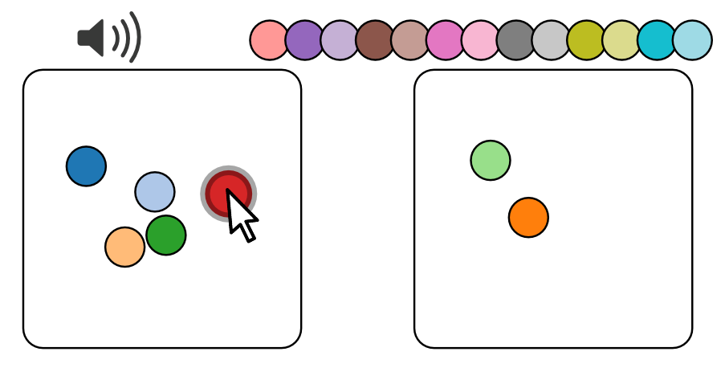
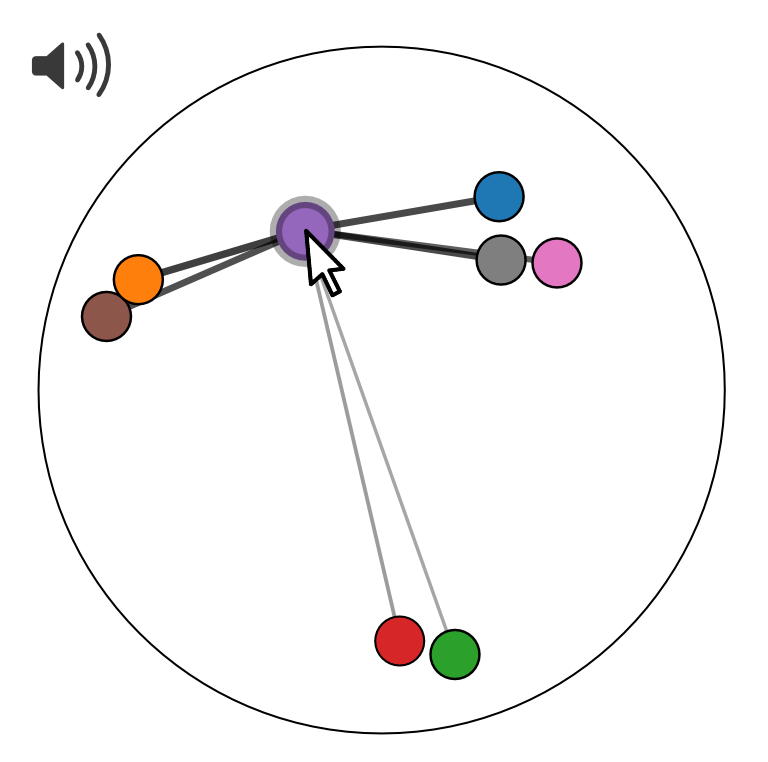
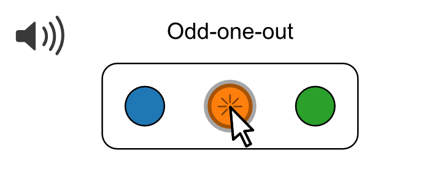

# Python tool to convert results

jsPsych has the option to save the experiment results in json (as shown above) or csv format. However the results from an Audio-Tokens trial contain ratings for multiple stimuli. To simplify further analysis, we provide a python command-line tool that converts the data coming from jsPsych to a spreadsheet in "long format".

This requires Python 3 to be installed along with the packages pandas, numpy and scipy.

In a terminal, navigate to the folder where you saved the `audio_tokens.py` file. You can call the script like this:

```
python audio_tokens.py --infile example_results.csv --outfile converted/example_results
```

where the first argument `--infile` specifies the path to the jsPsych result file, and `--outfile` specifies the path where the outputs of the script should be stored. Depending on the types of ratings that are present in the jsPsych results, different output files will be generated, as described further below.

If you saved the data in json format, you can call the script equivalently:

```
python audio_tokens.py --infile example_results.json --outfile converted/example_results
```

You can see the files that are generated by this command in [`converted/`](./converted/). In the following, we describe the results generated for the different rating interfaces.

- [Continuous ratings](#continuous-ratings)
- [Categorical ratings](#categorical-ratings)
- [Similarity ratings](#similarity-ratings)

## Continuous ratings

The results from continuous ratings are converted into long format as in [`converted/example_results_long.csv`](./converted/example_results_long.csv).

### Single feature rating


This is the long-format data after conversion, with one row per stimulus:

|    | stimulus                              | rating               | label     | trial_index | ratingtype |
|----|---------------------------------------|----------------------|-----------|-------------|------------|
| 0  | data/speaker1.wav   | 0.3    | Feature 1 | 0           | features   |
| 1  | data/speaker2.wav | 0.22142857142857142   | Feature 1 | 0           | features   |
| 2  | data/speaker3.wav | 1.   | Feature 1 | 0           | features   |
| 3  | data/speaker4.wav    | 0.6071428571428571  | Feature 1 | 0           | features   |

### Multiple feature ratings


This is the long-format data after conversion, with one row per stimulus and feature:

|    | stimulus                              | rating               | label     | trial_index | ratingtype |
|----|---------------------------------------|----------------------|-----------|-------------|------------|
| 4  | data/speaker1.wav   | 0.866672626268504    | Feature 1 | 1           | features   |
| 5  | data/speaker1.wav   | 0.9816046752452661   | Feature 2 | 1           | features   |
| 6  | data/speaker1.wav   | 0.18390191078672402  | Feature 3 | 1           | features   |
| 7  | data/speaker2.wav | 0.030335441432877003 | Feature 1 | 1           | features   |
| 8  | data/speaker2.wav | 0.7101214686567141   | Feature 2 | 1           | features   |
| 9  | data/speaker2.wav | 0.015445235979208001 | Feature 3 | 1           | features   |
| 10 | data/speaker3.wav | 0.642434748201779    | Feature 1 | 1           | features   |
| 11 | data/speaker3.wav | 0.8553972968875361   | Feature 2 | 1           | features   |
| 12 | data/speaker3.wav | 0.8302608464076421   | Feature 3 | 1           | features   |
| 13 | data/speaker4.wav    | 0.9156014687167651   | Feature 1 | 1           | features   |
| 14 | data/speaker4.wav    | 0.8864551408871011   | Feature 2 | 1           | features   |
| 15 | data/speaker4.wav    | 0.8288817129579941   | Feature 3 | 1           | features   |

### 2D feature ratings


This is the long-format data after conversion, with one row per stimulus and feature:

|    | stimulus                              | rating               | label     | trial_index | ratingtype |
|----|---------------------------------------|----------------------|-----------|-------------|------------|
| 16 | data/speaker1.wav   | 0.036318900336888005 | Feature 1 | 2           | features2d |
| 17 | data/speaker1.wav   | 0.5217651131909561   | Feature 2 | 2           | features2d |
| 18 | data/speaker2.wav | 0.5694705727097691   | Feature 1 | 2           | features2d |
| 19 | data/speaker2.wav | 0.09744539091327101  | Feature 2 | 2           | features2d |
| 20 | data/speaker3.wav | 0.6775501988992211   | Feature 1 | 2           | features2d |
| 21 | data/speaker3.wav | 0.7093288569088321   | Feature 2 | 2           | features2d |
| 22 | data/speaker4.wav    | 0.776809787725206    | Feature 1 | 2           | features2d |
| 23 | data/speaker4.wav    | 0.073891567888566    | Feature 2 | 2           | features2d |
| 24 | data/speaker5.wav   | 0.42796441186638906  | Feature 1 | 2           | features2d |
| 25 | data/speaker5.wav   | 0.6210122681801491   | Feature 2 | 2           | features2d |
| 26 | data/speaker6.wav | 0.272710851863457    | Feature 1 | 2           | features2d |
| 27 | data/speaker6.wav | 0.30906364416305204  | Feature 2 | 2           | features2d |
| 28 | data/speaker7.wav | 0.683470096617253    | Feature 1 | 2           | features2d |
| 29 | data/speaker7.wav | 0.46177898745321905  | Feature 2 | 2           | features2d |
| 30 | data/speaker8.wav   | 0.772064653933612    | Feature 1 | 2           | features2d |
| 31 | data/speaker8.wav   | 0.421123413068325    | Feature 2 | 2           | features2d |
| 32 | data/speaker9.wav   | 0.510168872549222    | Feature 1 | 2           | features2d |
| 33 | data/speaker9.wav   | 0.035947595568423    | Feature 2 | 2           | features2d |

## Categorical ratings

The results from categorical ratings are also converted into long format as in [`converted/example_results_long.csv`](./converted/example_results_long.csv).

### Fixed number of categories



This is the long-format data after conversion, with one row per stimulus. The column `rating` now contains the label of the category:

|    | stimulus                              | rating               | label     | trial_index | ratingtype |
|----|---------------------------------------|----------------------|-----------|-------------|------------|
| 34 | data/speaker1.wav   | Category 2           | category  | 3           | categories |
| 35 | data/speaker2.wav | Category 2           | category  | 3           | categories |
| 36 | data/speaker3.wav | Category 1           | category  | 3           | categories |
| 37 | data/speaker4.wav    | Category 2           | category  | 3           | categories |
| 38 | data/speaker5.wav   | Category 2           | category  | 3           | categories |
| 39 | data/speaker6.wav | Category 1           | category  | 3           | categories |
| 40 | data/speaker7.wav | Category 2           | category  | 3           | categories |
| 41 | data/speaker8.wav   | Category 2           | category  | 3           | categories |
| 42 | data/speaker9.wav   | Category 1           | category  | 3           | categories |

### Variable number of categories


This is the long-format data after conversion, with one row per stimulus. The column `rating` now contains the label of the cluster: `cluster_*` depending on how many clusters the participant has generated.

|    | stimulus                              | rating               | label     | trial_index | ratingtype |
|----|---------------------------------------|----------------------|-----------|-------------|------------|
| 43 | data/speaker1.wav   | cluster_2            | cluster   | 4           | cluster    |
| 44 | data/speaker2.wav | cluster_1            | cluster   | 4           | cluster    |
| 45 | data/speaker3.wav | cluster_2            | cluster   | 4           | cluster    |
| 46 | data/speaker4.wav    | cluster_1            | cluster   | 4           | cluster    |
| 47 | data/speaker5.wav   | cluster_1            | cluster   | 4           | cluster    |
| 48 | data/speaker6.wav | cluster_2            | cluster   | 4           | cluster    |
| 49 | data/speaker7.wav | cluster_2            | cluster   | 4           | cluster    |
| 50 | data/speaker8.wav   | cluster_1            | cluster   | 4           | cluster    |
| 51 | data/speaker9.wav   | cluster_1            | cluster   | 4           | cluster    |

## Similarity ratings

The results from categorical ratings require a different format and are converted into separate files.

### Unconstrained similarity rating



The values you get in the jsPsych results are [x, y] coordinates, these can be interpreted like this: The arena where the tokens can be placed is a circle with radius .5, so the coordinate [0, 0] will be the center of the circle, [-0.5, 0] e.g. will be the leftmost coordinate that you can place a token, [0.5, 0] the rightmost, etc. This means that the maximum distance between two tokens is 1.

Using the python script, the results from these trials are converted trial by trial into similarity matrices. Similarity is computed as 1-distance, such that 0=most dissimilar, 1=most similar. The matrices are saved in the following format [`converted/example_results_similarity_trial5.csv`](./converted/example_results_similarity_trial5.csv):

|                                       | data/speaker1.wav | data/speaker2.wav | data/speaker3.wav | data/speaker4.wav | data/speaker5.wav | data/speaker6.wav | data/speaker7.wav | data/speaker8.wav | data/speaker9.wav |
|---------------------------------------|-------------------------------------|---------------------------------------|---------------------------------------|------------------------------------|-------------------------------------|---------------------------------------|---------------------------------------|-------------------------------------|-------------------------------------|
| data/speaker1.wav   | 1.0                                 | 0.6539315927380527                    | 0.3947430267086318                    | 0.32069237548229834                | 0.4880016506095156                  | 0.3422151580308168                    | 0.4786879258785913                    | 0.3381430395868025                  | 0.8402563005092503                  |
| data/speaker2.wav | 0.6539315927380527                  | 1.0                                   | 0.6746134693083229                    | 0.5082266308815153                 | 0.5705261069865615                  | 0.592362739522948                     | 0.5634447624713115                    | 0.294310434643568                   | 0.6206465100989217                  |
| data/speaker3.wav | 0.3947430267086318                  | 0.6746134693083229                    | 1.0                                   | 0.7760272168949112                 | 0.6853666811362853                  | 0.9055118525285228                    | 0.6852040983501895                    | 0.38682062410202933                 | 0.444565084849067                   |
| data/speaker4.wav    | 0.32069237548229834                 | 0.5082266308815153                    | 0.7760272168949112                    | 1.0                                | 0.7900726850777582                  | 0.8604685093194286                    | 0.7965718502397586                    | 0.5552985239222881                  | 0.4213449002047033                  |
| data/speaker5.wav   | 0.4880016506095156                  | 0.5705261069865615                    | 0.6853666811362853                    | 0.7900726850777582                 | 1.0                                 | 0.7165385278981764                    | 0.9906846596427515                    | 0.6951661720407463                  | 0.6117873017911535                  |
| data/speaker6.wav | 0.3422151580308168                  | 0.592362739522948                     | 0.9055118525285228                    | 0.8604685093194286                 | 0.7165385278981764                  | 1.0                                   | 0.7191247391159044                    | 0.4366616131184611                  | 0.4128353821871811                  |
| data/speaker7.wav | 0.4786879258785913                  | 0.5634447624713115                    | 0.6852040983501895                    | 0.7965718502397586                 | 0.9906846596427515                  | 0.7191247391159044                    | 1.0                                   | 0.6976791168515393                  | 0.6027453958228249                  |
| data/speaker8.wav   | 0.3381430395868025                  | 0.294310434643568                     | 0.38682062410202933                   | 0.5552985239222881                 | 0.6951661720407463                  | 0.4366616131184611                    | 0.6976791168515393                    | 1.0                                 | 0.49641108051353233                 |
| data/speaker9.wav   | 0.8402563005092503                  | 0.6206465100989217                    | 0.444565084849067                     | 0.4213449002047033                 | 0.6117873017911535                  | 0.4128353821871811                    | 0.6027453958228249                    | 0.49641108051353233                 | 1.0                                 |

### Relative similarity rating in the triplet task



The results from these trials are converted into long format in the following way [`converted/example_results_triplets.csv`](./converted/example_results_triplets.csv). Each row represents one triplet and has three columns for filenames (`stim_0, stim_1, stim_2`). Column `selected` specifies the stimulus that was selected as the odd-one-out (`0, 1` or `2`). Column `last_selected` specifies which position was selected last, i.e. which of the stimuli is new (`0, 1, 2`, or `3` if it's the first triplet in this trial). Column `i_triplet` specifies the order of the triplet within the current trial.

|   | stim_0                                | stim_1                                | stim_2                                | selected | last_selected | trial_index | i_triplet |
|---|---------------------------------------|---------------------------------------|---------------------------------------|----------|---------------|-------------|-----------|
| 0 | data/speaker1.wav   | data/speaker2.wav | data/speaker3.wav | 0        | 3            | 6           | 0         |
| 1 | data/speaker4.wav    | data/speaker2.wav | data/speaker3.wav | 1        | 0             | 6           | 1         |
| 2 | data/speaker4.wav    | data/speaker5.wav   | data/speaker3.wav | 0        | 1             | 6           | 2         |
| 3 | data/speaker6.wav | data/speaker5.wav   | data/speaker3.wav | 2        | 0             | 6           | 3         |
| 4 | data/speaker6.wav | data/speaker5.wav   | data/speaker7.wav | 1        | 2             | 6           | 4         |
| 5 | data/speaker6.wav | data/speaker8.wav   | data/speaker7.wav | 0        | 1             | 6           | 5         |
| 6 | data/speaker9.wav   | data/speaker8.wav   | data/speaker7.wav | 1        | 0             | 6           | 6         |

